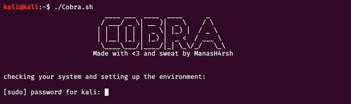
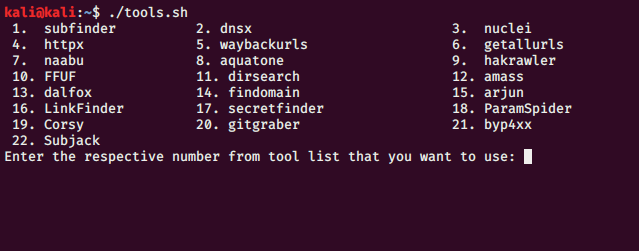

# 🐍Cobra

An All in one tool to make your hacking easier:)

This tool contains pre-built tools from the community and it has tools from GO and Python. I have built this tool to make the hacking easier since you will find all the tools on one place and these can be used accordingly as per your need. If you are new to recon thing, this might help you in using multiple tools from a single script. Also, this tool will install all the necessary scripts itself. Feel free to contribute if you have ideas:)

## 🧰 Tools:

The tools script installs :- 

 

## 💠 Installation:

* `git clone https://github.com/ManasHarsh/Cobra.git`
* `cd Cobra`
* `chmod +x *.sh`
* `./Cobra.sh`

## 📖 Usage:
* for tool install `./Cobra.sh`
* to use tools `./tools.sh`

## 🙏 Credits:
* Tomnomnom(https://github.com/tomnomnom)
* ProjectDiscovery team(https://github.com/projectdiscovery)
* Hakluke(https://github.com/hakluke)
* Corben Leo(https://github.com/lc)
* Michel Henriksen(https://github.com/michenriksen)
* Somdev Sangwan (https://github.com/s0md3v)

## 📑 Notes:
* In "gitGraber", please make sure to define your wordlist for scrapping the data.
* Make sure you have all the tools installed in home directory otherwise you'll need to define the path for tools. 

It takes time in first isntance. Once everything gets loaded, it will work fine.

## ✨ Special thanks 
<table>
  <tr>
<td align="center"><a href="https://github.com/amnjha/"> <b>Aman Jha</b></a> <a href="https://amnjha.github.io" title="Aman Jha">✅</a></td>
     </tr>
</table>

## 🔖 Legal disclaimer:
The script is made for educational and ethical purposes only. Usage of the script for attacking targets without prior mutual consent is illegal. I am not responsible for any misuse or damage caused by this script.

## 🐳 Cobra with Docker:

Pull the latest tagged Cobra docker image:

`docker pull manasharsh/cobra:latest`

Run the image with this command:

`docker run -it --entrypoint bash manasharsh/cobra`

Launch the cobra agent:

`./Cobra.sh`

